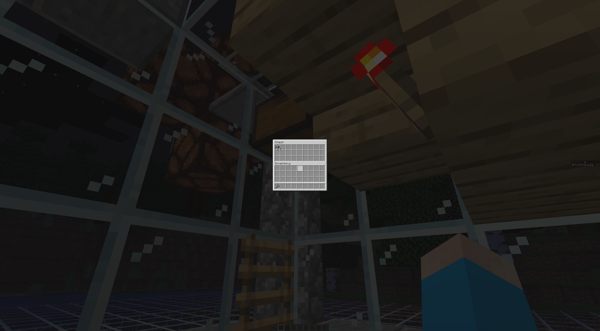
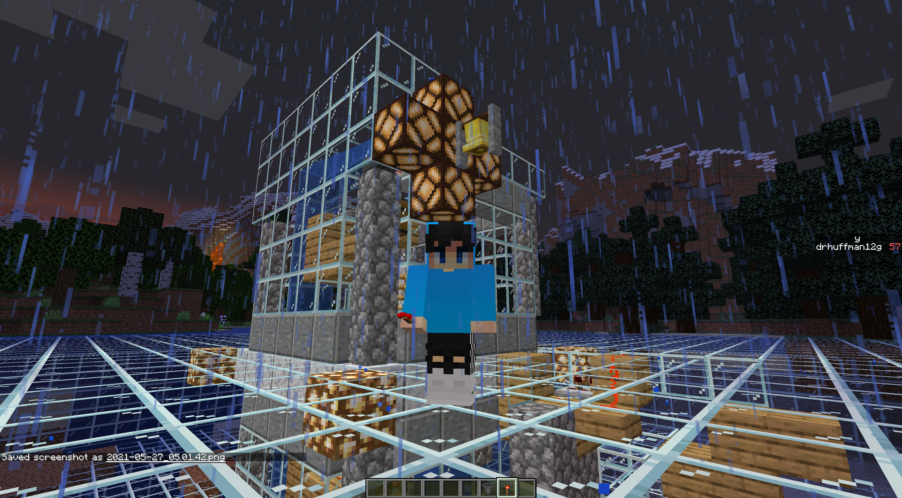

# my_minecraft_datapacks

## Copy this repo to some folder locally:

```
cd $SOME_FOLDER
git clone https://github.com/drhuffman12/my_minecraft_datapacks.git
```

## Launch your game

Launch minecraft and create/open your `$SAVED_GAME`.

## Add the datapacks

Open a terminal and browse to your 'datapacks' folder under your saved game folder; e.g.: `~/.minecraft/saves/$SAVED_GAME/datapacks`.

Copy the contents of 'my_minecraft_datapacks' under that 'datapacks' folder:

```
rm -r drh ; cp -r $SOME_FOLDER/my_minecraft_datapacks/drh/ ~/.minecraft/saves/$SAVED_GAME/datapacks ; ls -al
```

## Check your loaded datapacks

Type `t` and then `/datapack list`.

This should show something like:

```
There are 1 data packs enabled: [vanilla (built-in)]
There are 1 data packs available: [file/drh (world)]
```

## Reload your datapacks

Type `t` and enter `/reload`; then re-run `/datapack list`.

This should show something like:

```
There are 2 data packs enabled: [vanilla (built-in)], [file/drh (world)]
There are no more data packs available.
```

## Prep your mine

Go to somewhere (above ground) where you want the X-Z center of your mine to be.

Type `/function drh:excavate`.

This will excavate a few layers from Y 2 to Y 15, add some glass floors between, and leaving the non-ores to be mined.


Also, it will generate a vertical pathway from your initial position down to the mine, along with some water elevators to/from the 'penthouse' at the top.


NOTE: This is also supposed to run `/function drh:add_item_elevator_downward_upper_level` at the top, but it is not working. So, you have to go outside and dig down to the the cobblestone block surrounded by glass blocks and stand on the cobblestone block. When you're there (and air above you), run `/function drh:add_item_elevator_downward_upper_level`, then climb your way back out.


## Ore Harvesting

Place your ores/items/etc into the droppers along the ore water elevator.


You might want to add some furnaces at each level or maybe just at the top.

They will travel up the water elevator.


When they get to the top, they'll travel across and down into a hopper and then into a chest. 



When they get to the hopper, they'll trigger the bell and light up the redstone lamps.




Feel free to connect an item sorters (and maybe furnaces) here. (I might add that later, unless someone else submits a good PR with one first.)

## Contributing

After editing the ddddd files, be sure to run `mcscript compile` and make sure it succeeds; e.g.:

```
$ mcscript compile
 Generated   .//drh/data/drh/functions/mcscript/load.mcfunction 
 Generated   .//drh/data/drh/functions/add_ceiling.mcfunction 
 Generated   .//drh/data/drh/functions/tunnel_down.mcfunction 
 Generated   .//drh/data/drh/functions/excavate.mcfunction 
 Generated   .//drh/data/drh/functions/load.mcfunction 
 Generated   .//drh/data/drh/functions/test.mcfunction 
 Generated   .//node_modules/mcscript/lib/modals/basic.mcfunction 
 Generated   .//drh/data/drh/functions/prep_mine.mcfunction 
 Generated   .//drh/data/drh/functions/main.mcfunction 
```

## See also:

* https://github.com/Stevertus/mcscript
* https://www.reddit.com/r/MinecraftCommands/comments/lshgly/minecraft_datapack_programming_language/
